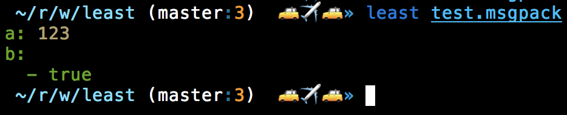

# Terminal file viewer

Wow. Such viewer. Much ANSI.



### Usage

```sh
# install the binary globally
npm install -g least
```

Gots a file? View it:

```sh
# you can enter multiple files
least whatever.msgpack another.yaml
```
